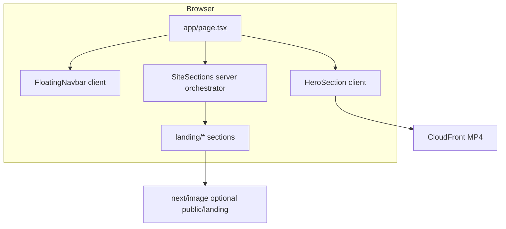

# PharmaOpenings — Product & Engineering Documentation

**Repository:** `pharma-openings`  
**Product:** PharmaOpenings.com — a premium marketing and discovery surface for pharmaceutical careers.  
**Status:** Frontend landing experience (static + client-enhanced UI). No authenticated product surface, API layer, or database in this repository yet.

This document serves as both **product context** and **technical reference** for engineers, designers, and stakeholders. It is maintained to match the codebase as closely as possible.

---

## Table of contents

1. [Executive summary](#1-executive-summary)
2. [Product vision & positioning](#2-product-vision--positioning)
3. [Goals & non-goals](#3-goals--non-goals)
4. [Target users](#4-target-users)
5. [Current product scope](#5-current-product-scope)
6. [User journeys (as implemented)](#6-user-journeys-as-implemented)
7. [Page & section specification](#7-page--section-specification)
8. [Functional requirements matrix](#8-functional-requirements-matrix)
9. [Content & configuration](#9-content--configuration)
10. [Media & assets](#10-media--assets)
11. [Technical architecture](#11-technical-architecture)
12. [Repository structure](#12-repository-structure)
13. [Technology stack](#13-technology-stack)
14. [Design system](#14-design-system)
15. [Motion & interaction](#15-motion--interaction)
16. [SEO & metadata](#16-seo--metadata)
17. [Accessibility](#17-accessibility)
18. [Performance & reliability](#18-performance--reliability)
19. [Security & privacy (current state)](#19-security--privacy-current-state)
20. [Environment variables](#20-environment-variables)
21. [Scripts & commands](#21-scripts--commands)
22. [Local development](#22-local-development)
23. [Build & production](#23-build--production)
24. [Deployment](#24-deployment)
25. [Quality gates](#25-quality-gates)
26. [Testing strategy (recommended)](#26-testing-strategy-recommended)
27. [Known limitations](#27-known-limitations)
28. [Roadmap (suggested)](#28-roadmap-suggested)
29. [Contributing & conventions](#29-contributing--conventions)
30. [AI / agent notes](#30-ai--agent-notes)
31. [Changelog discipline](#31-changelog-discipline)
32. [License & confidentiality](#32-license--confidentiality)

---

## 1. Executive summary

**PharmaOpenings** is positioned as a curated destination connecting talent with pharmaceutical and life-sciences opportunities. This repository implements a **single high-end landing page**: hero with background video, job search entry point, narrative sections (stats, partners, employer CTA, “how it works” showcase with image slots, featured job cards, about, contact), and a global floating navigation bar.

The implementation prioritizes **editorial UI**, **modular React components**, **Tailwind CSS v4**, and **Motion** for entrance and hover feedback. Business logic is intentionally thin: forms use standard HTTP GET, links use in-page anchors, and marketing copy is centralized in TypeScript for maintainability.

---

## 2. Product vision & positioning

- **Vision:** A calm, trustworthy layer between candidates and employers in regulated industries—not a noisy generic job board.
- **Tone:** Premium, minimal, pastel-forward (navy + lavender + violet), generous whitespace, restrained motion.
- **Brand promise (copy-driven):** Curated roles, clarity of process, and human contact (mailto) for partnerships and accounts.

---

## 3. Goals & non-goals

### Goals (implemented)

- Deliver a **world-class visual landing** that reflects PharmaOpenings positioning.
- Provide a **clear job search entry** (keyword + location) that can later be wired to search APIs or routes.
- Surface **employer**, **about**, and **contact** narratives with consistent design language.
- Keep **content editable without touching layout code** (`app/components/landing/content.ts`).
- Reserve **image slots** for high-fidelity creative (compliance profile, documents, coordination) without shipping placeholder illustrations that would be replaced.

### Non-goals (not in this repo today)

- User authentication, sessions, or OAuth.
- Job ingestion, scraping, ATS integrations, or admin CMS.
- Server-side search, pagination, or filters.
- Payments, billing, or employer self-serve checkout.
- Email send pipelines (only `mailto:` links).
- i18n / multi-locale routing.
- Native mobile apps.

---

## 4. Target users

| Persona | Needs addressed on the landing page |
|--------|-------------------------------------|
| **Candidate** | Understand value prop, search by role/location, browse representative listings, find contact for help. |
| **Employer / talent partner** | See why to list roles, CTA to contact, alignment with regulated hiring language. |
| **Internal marketing / design** | Swap copy in `content.ts`, drop images into `public/landing/`, tune tokens in `globals.css`. |
| **Engineering** | Extend routes under `app/`, replace static job data with API-driven components, add tests and CI. |

---

## 5. Current product scope

| Area | Included |
|------|----------|
| Routes | `/` (home) only; `_not-found` from Next.js. |
| Layout | Root `app/layout.tsx` (fonts, global CSS, default metadata). |
| Home composition | `FloatingNavbar` + `HeroSection` + `SiteSections` inside `<main>`. |
| Data | Static TypeScript exports; no external CMS or DB. |
| APIs | None. |

---

## 6. User journeys (as implemented)

1. **Land on home**  
   User sees hero (video + gradient), headline, supporting copy, search form, trust pills.

2. **Search jobs (client-side navigation only)**  
   User submits the hero form → browser navigates to `GET /?q=...&location=...`. There is **no** dedicated results page yet; the query string is preserved for future handling (middleware, rewrite to `/jobs`, or client read of `useSearchParams`).

3. **Navigate in-page**  
   Navbar and footer link to fragment IDs (`#browse`, `#employers`, `#process`, `#featured-jobs`, `#about`, `#contact`). Scroll margin is set on key sections for fixed navbar clearance.

4. **Employer intent**  
   User reads employers strip → “Partner with us” scrolls to `#contact`.

5. **Account / sign-in intent**  
   Navbar “Sign up” / “Sign in” point to `#contact` with copy explaining email-based onboarding (no real auth).

6. **Featured role — Apply now**  
   Each job card shows **Apply now**. Today it uses the same placeholder target as other interim CTAs (`JOB_APPLY_PLACEHOLDER_HREF` in `content.ts`, default `#contact`). **Planned:** point to sign-up, login, or a per-job application flow (see §8 FR-10).

7. **Contact**  
   User taps `hello@pharmaopenings.com` → opens default mail client.

---

## 7. Page & section specification

### 7.1 Global chrome

| Element | File | Behavior |
|---------|------|----------|
| **Floating navbar** | `app/components/FloatingNavbar.tsx` | Fixed, glass pill, logo + `PHARMAOPENINGS` wordmark, desktop nav links, Sign up / Sign in, mobile menu. Client component (`useState` for menu). |
| **Logo** | Inline in `FloatingNavbar` | Violet gradient circle + mark SVG. |

**Nav links (desktop & mobile):**  
`/` · `#browse` · `#featured-jobs` · `#employers` · `#about` · `#contact` · Sign up / Sign in → `#contact`.

### 7.2 Hero

| Element | File | Notes |
|---------|------|------|
| Full-viewport section | `app/components/HeroSection.tsx` | `min-h-screen`, centered column, `max-w-[1200px]`, top padding `290px` for editorial spacing. |
| Background video | Same | Remote MP4 (CloudFront). `object-cover`, vertical flip `scaleY(-1)` per design spec. |
| Gradient overlay | Same | White gradient to blend video into page. |
| Headline | Same | Geist + **Instrument Serif** italic on “talent”; responsive clamp + `lg` fixed sizes. |
| Description | Same | Geist, 18px class, muted slate, `max-w-[554px]`. |
| Job search | Same | Grid-based shell to avoid overlap; fields `q`, `location`; submit “Search jobs”. |
| Trust pills | Same | R&D / Clinical & regulatory / Commercial. |
| Motion | Same | Staggered fade + slide up via `motion/react`. |

**Video source (hardcoded in component):**  
`https://d8j0ntlcm91z4.cloudfront.net/user_38xzZboKViGWJOttwIXH07lWA1P/hf_20260302_085640_276ea93b-d7da-4418-a09b-2aa5b490e838.mp4`  
To change: edit `VIDEO_SRC` in `HeroSection.tsx` (future improvement: env-based URL).

**Hero search anchor:** wrapper `id="browse"` for `scroll-mt` and nav targets.

### 7.3 Landing body (`SiteSections`)

Orchestrator: `app/components/SiteSections.tsx` — imports from `app/components/landing/index.ts` and renders in order:

| # | Section | Component | Anchor ID | Purpose |
|---|---------|-----------|-----------|---------|
| 1 | Stats banner | `StatsBanner.tsx` | — | Navy card + violet highlight + three stat columns (copy from `STATS_BANNER`). |
| 2 | Trusted partners | `PartnerLogos.tsx` | — | Badge + headline + monogram placeholders (`PARTNERS_SECTION`). |
| 3 | Employers strip | `EmployersStrip.tsx` | `employers` | Short pitch + CTA to contact. |
| 4 | How it works / showcase | `FeatureShowcase.tsx` | `process` | 2× top cards + 1× full-width split row; each card uses `ImageSlot` for future assets. |
| 5 | Featured jobs | `PopularJobs.tsx` + `JobCard.tsx` | `featured-jobs` | List of `JOB_LISTINGS` as cards; Motion stagger + hover; each card has **Apply now** (href from `JOB_APPLY_PLACEHOLDER_HREF` until auth/apply routes exist). |
| 6 | About | `AboutSection.tsx` | `about` | Mission paragraphs from `ABOUT_SECTION`. |
| 7 | Contact | `ContactSection.tsx` | `contact` | Card + email + footnote from `CONTACT_SECTION`. |
| 8 | Footer | `SiteFooter.tsx` | — | Copyright year + anchor links. |

---

## 8. Functional requirements matrix

| ID | Requirement | Status | Notes |
|----|-------------|--------|------|
| FR-01 | Render landing at `/` | Done | `app/page.tsx`. |
| FR-02 | In-page anchor navigation | Done | IDs on sections / hero search. |
| FR-03 | Hero job search submits GET `/` | Done | Query params `q`, `location`. |
| FR-04 | Display static featured jobs | Done | `JOB_LISTINGS` in `content.ts`. |
| FR-05 | Contact via mailto | Done | `CONTACT_SECTION.email`. |
| FR-06 | Responsive navbar | Done | Mobile sheet menu. |
| FR-07 | Optional showcase images | Partial | Wire `LANDING_MEDIA_PATHS` + files under `public/landing/`. |
| FR-08 | Job search results | Not implemented | Requires new route + data source. |
| FR-09 | Auth (sign in/up) | Not implemented | Nav points to `#contact` as interim. |
| FR-10 | Apply now on featured jobs | Done (placeholder) | **Apply now** on each `JobCard`; target is `JOB_APPLY_PLACEHOLDER_HREF` (`#contact` by default). **Future:** `/sign-up`, `/login`, `/jobs/[id]/apply`, or modal—change once in `content.ts` or pass per-listing `applyHref` when data model supports it. |

---

## 9. Content & configuration

All marketing structure and copy for landing sections (except the hero video URL and hero-specific layout constants) should be edited in:

**`app/components/landing/content.ts`**

Exports include:

| Export | Purpose |
|--------|---------|
| `FeatureImageKey` | Union type for image slot keys. |
| `LANDING_MEDIA_PATHS` | Map keys → `/public/...` paths for `next/image`. |
| `STATS_BANNER` | Highlight block + three stats. |
| `PARTNERS_SECTION` | Badge, title, partner list (`id`, `name`, `initials`). |
| `FEATURE_SHOWCASE` | Section headers + three feature blocks (titles, bodies, CTA, `imageKey`). |
| `POPULAR_JOBS_SECTION` | Section badge, title, subtitle. |
| `JOB_APPLY_PLACEHOLDER_HREF` | URL/hash for every **Apply now** button on featured job cards until real sign-up/login/apply flows ship. |
| `JOB_LISTINGS` | Array of job rows (id, title, company, tags, salaryDisplay, location). |
| `EMPLOYERS_STRIP` | Title, body, CTA label, `href`. |
| `ABOUT_SECTION` | Badge, title, `paragraphs[]`. |
| `CONTACT_SECTION` | Badge, title, body, email, footnote. |

**Important:** Stat headlines and job listings are **presentational placeholders** until backed by real analytics and ATS data. Update or remove any figures that cannot be substantiated.

---

## 10. Media & assets

### 10.1 Hero video

- Loaded from **external CDN** (see §7.2). Not stored under `public/`.
- Consider **CSP**, **bandwidth**, and **availability** if the URL changes or is removed.

### 10.2 Showcase images (feature grid)

1. Add files under **`public/landing/`** (recommended filenames align with keys):  
   e.g. `compliance.png`, `documents.png`, `coordination.png`.

2. Uncomment / set paths in **`LANDING_MEDIA_PATHS`** in `content.ts`:

```ts
export const LANDING_MEDIA_PATHS = {
  compliance: "/landing/compliance.png",
  documents: "/landing/documents.png",
  coordination: "/landing/coordination.png",
};
```

3. **`ImageSlot`** (`app/components/landing/ImageSlot.tsx`) renders `next/image` when a path exists; otherwise a dashed **reserved frame** with instructions.

**Image guidelines:** Prefer WebP/AVIF for size; keep large hero art within reasonable dimensions (e.g. 1600px wide) to avoid oversized downloads.

### 10.3 Fonts

Loaded via `next/font/google` in `app/layout.tsx`:

- **Geist** (`--font-geist-sans`) — primary UI.
- **Geist Mono** (`--font-geist-mono`) — available for future monospace UI.
- **Instrument Serif** (`--font-instrument-serif`) — normal + italic for editorial accents.

### 10.4 Static files in `public/`

Default Create Next App assets (`vercel.svg`, etc.) may remain unused; safe to delete when cleaning branding.

---

## 11. Technical architecture



- **Rendering:** App Router. `SiteSections` is a **Server Component** that composes **Client Components** where interactivity or Motion is required (`"use client"` on those files).
- **Styling:** Tailwind v4 via `@import "tailwindcss"` in `globals.css` and PostCSS plugin.
- **Path alias:** `@/*` → project root (`tsconfig.json`).

---

## 12. Repository structure

```
pharma-openings/
├── AGENTS.md                 # Next.js version caveat for AI tooling
├── CLAUDE.md                 # Points to AGENTS.md
├── README.md                 # This file
├── package.json
├── package-lock.json
├── tsconfig.json
├── next.config.ts            # Default Next config (extend for images/headers as needed)
├── postcss.config.mjs        # @tailwindcss/postcss
├── eslint.config.mjs         # eslint-config-next (core-web-vitals + typescript)
├── public/                   # Static assets (SVG defaults; add landing/ for showcase)
├── app/
│   ├── globals.css           # Tailwind + CSS variables (--color-po-*, fonts)
│   ├── layout.tsx            # Root layout, fonts, metadata
│   ├── page.tsx              # Home: Nav + main(Hero + SiteSections)
│   └── components/
│       ├── FloatingNavbar.tsx
│       ├── HeroSection.tsx
│       ├── SiteSections.tsx  # Composes landing sections only
│       └── landing/
│           ├── index.ts      # Barrel exports
│           ├── content.ts    # Single source of truth for landing copy/data
│           ├── SectionHeader.tsx
│           ├── StatsBanner.tsx
│           ├── PartnerLogos.tsx
│           ├── EmployersStrip.tsx
│           ├── FeatureShowcase.tsx
│           ├── ImageSlot.tsx
│           ├── JobCard.tsx
│           ├── PopularJobs.tsx
│           ├── AboutSection.tsx
│           ├── ContactSection.tsx
│           └── SiteFooter.tsx
```

---

## 13. Technology stack

| Layer | Choice | Version (see `package.json`) |
|-------|--------|------------------------------|
| Framework | Next.js (App Router) | 16.2.3 |
| UI library | React | 19.2.4 |
| Language | TypeScript | ^5 |
| Styling | Tailwind CSS | ^4 |
| PostCSS | `@tailwindcss/postcss` | ^4 |
| Animation | Motion (`motion/react`) | ^12.38.0 |
| Lint | ESLint + `eslint-config-next` | 9 / 16.x |

**Note:** Next.js 16 may differ from older docs. See `AGENTS.md` and in-repo `node_modules/next/dist/docs/` when upgrading or using new APIs.

---

## 14. Design system

### 14.1 Semantic tokens (`app/globals.css`)

Defined under `@theme inline` (Tailwind v4):

| Token | Approx. use |
|-------|-------------|
| `--color-po-navy` | Deep navy text / stats banner background |
| `--color-po-muted` | Muted body (#6b6880 class usage in components) |
| `--color-po-lavender` | Soft surfaces |
| `--color-po-lavender-deep` | Deeper lavender accents |
| `--color-po-violet` | Primary accent / CTAs |

Components also use **inline hex** for fine-tuned gradients; over time, prefer mapping these to tokens for consistency.

### 14.2 Hero vs landing body

- **Hero:** White-to-video blend, neutral typography, editorial headline.
- **Body:** Pastel lavender page background (`#f7f4fd`), navy + violet for stats and CTAs.

### 14.3 Dark mode

`globals.css` includes `prefers-color-scheme: dark` overrides for `:root` background/foreground. The landing UI is **light-first**; if dark mode parity is required, audit each section for contrast and backgrounds.

---

## 15. Motion & interaction

| Location | Library | Behavior |
|----------|---------|----------|
| Hero | `motion/react` | Staggered children: headline, body, search block. |
| Stats banner | `motion/react` | Viewport fade/slide on enter. |
| Feature cards | `motion/react` | Viewport reveal + subtle hover lift. |
| Job list | `motion/react` | Stagger on scroll into view; list items lift on hover. |

Easing uses cubic-bezier arrays where required for strict Motion typing (`as const`).

---

## 16. SEO & metadata

- **Default metadata** in `app/layout.tsx`: `title`, `description` for PharmaOpenings.
- **Open Graph / Twitter cards:** Not explicitly configured; add via `metadata` or `generateMetadata` when sharing requirements are defined.
- **Structured data (JSON-LD):** Not implemented; consider `JobPosting` when listings are dynamic and canonical URLs exist.

---

## 17. Accessibility

Implemented patterns include:

- `sr-only` labels on hero search inputs.
- `aria-label` on nav; mobile menu `aria-expanded` / `aria-controls`.
- Semantic sections, headings hierarchy, `footer` nav.
- Image slot placeholder uses `role="img"` + `aria-label` when no file is set.

**Recommended follow-ups:** skip-to-content link, focus trap in mobile menu, reduced-motion media query to tone down Motion.

---

## 18. Performance & reliability

- **Video:** Autoplay, muted, loop, `playsInline` for mobile; consider poster image and `preload` strategy if LCP regresses.
- **Fonts:** `next/font` subsets and CSS variables reduce layout shift.
- **Images:** `next/image` for showcase when paths are set; `sizes` tuned in `ImageSlot`.
- **Third-party video URL:** Single point of failure if CDN is down—monitor or self-host if critical.

---

## 19. Security & privacy (current state)

- No secrets in repo; no `.env` required for local dev.
- **mailto:** exposes contact email to scrapers—acceptable for public marketing; consider form + spam protection for scale.
- **External video:** Subresource loaded from CloudFront—review domain allowlists if CSP is added.

---

## 20. Environment variables

None required today. Suggested future variables (document when added):

| Variable | Purpose |
|----------|---------|
| `NEXT_PUBLIC_SITE_URL` | Canonical base URL for metadata and OG tags. |
| `NEXT_PUBLIC_HERO_VIDEO_URL` | Externalize hero MP4 URL. |
| `NEXT_PUBLIC_*` | Any public API base for job search. |

---

## 21. Scripts & commands

| Command | Description |
|---------|-------------|
| `npm run dev` | Start Next.js dev server (Turbopack in Next 16 default workflow). |
| `npm run build` | Production build + TypeScript check. |
| `npm run start` | Serve production build locally. |
| `npm run lint` | Run ESLint (Next core-web-vitals + TypeScript rules). |

---

## 22. Local development

**Prerequisites:** Node.js compatible with Next.js 16 (see Next.js docs), npm (or use your preferred package manager consistently).

```bash
cd pharma-openings
npm install
npm run dev
```

Open **http://localhost:3000**.

**Path alias:** Imports like `@/app/...` resolve from repository root.

---

## 23. Build & production

```bash
npm run build
npm run start
```

The build must complete with **no TypeScript errors**. CI should run `npm run build` and `npm run lint` on every merge.

---

## 24. Deployment

Compatible with any Node host that supports Next.js (e.g. **Vercel**, container platforms, or custom Node servers following Next deployment guides).

**Checklist before go-live:**

- [ ] Replace or verify placeholder stats and job rows in `content.ts`.
- [ ] Add showcase images under `public/landing/` and enable `LANDING_MEDIA_PATHS`.
- [ ] Confirm hero video URL and rights.
- [ ] Set canonical URL and OG metadata.
- [ ] Configure redirects from `/?q=` to real search when implemented.
- [ ] Review `mailto` address and inbox readiness.

---

## 25. Quality gates

| Gate | Command / action |
|------|------------------|
| Lint | `npm run lint` |
| Typecheck + compile | `npm run build` |
| Manual | Responsive breakpoints, anchor scroll with fixed nav, form GET query string. |

---

## 26. Testing strategy (recommended)

Not implemented in-repo yet. Suggested progression:

1. **Unit:** Pure formatters / mappers when API layer exists.
2. **Component:** React Testing Library for `JobCard`, `ImageSlot` (with and without src).
3. **E2E:** Playwright for nav anchors, mobile menu, form submit URL.

---

## 27. Known limitations

- No backend; search and jobs are static or query-only on `/`.
- **Apply now** on featured jobs is a visual + navigation affordance only; it does not submit an application or open a real auth form yet (see `JOB_APPLY_PLACEHOLDER_HREF`).
- Navbar “Sign up” / “Sign in” do not open real auth flows.
- Partner “logos” are monogram placeholders.
- Showcase stats may not reflect real business metrics until updated.
- Dark mode styling for new landing sections is not fully audited.

---

## 28. Roadmap (suggested)

1. **`/jobs` route** — Read `searchParams`, connect to search API or static JSON.
2. **CMS or MDX** — Optional for non-engineer copy updates.
3. **Design tokens** — Consolidate hex usage to `@theme` utilities.
4. **Auth** — Dedicated `/sign-in`, `/sign-up` when product requirements exist; then repoint **`JOB_APPLY_PLACEHOLDER_HREF`** (or per-job `applyHref` in `JOB_LISTINGS`) so **Apply now** opens sign-up/login or an authenticated apply flow.
5. **Analytics** — Privacy-conscious events (section views, CTA clicks).
6. **Legal** — Privacy policy, terms, cookie banner if EU traffic and tracking.

---

## 29. Contributing & conventions

- **Single responsibility:** New sections → new file under `app/components/landing/`; export from `landing/index.ts`; compose from `SiteSections.tsx`.
- **Content vs presentation:** Prefer editing `content.ts` over hardcoding strings in JSX.
- **Client boundaries:** Add `"use client"` only where hooks or Motion are needed to keep bundles lean.
- **Imports:** Prefer `@/` for cross-folder imports from app root.
- **Do not** commit secrets, real user data, or unlicensed media.

---

## 30. AI / agent notes

See **`AGENTS.md`**: this project targets **Next.js 16**, which may differ from older training data. Before large refactors, consult `node_modules/next/dist/docs/` for current APIs and deprecations.

---

## 31. Changelog discipline

When shipping meaningful changes, append a **CHANGELOG.md** entry (Keep a Changelog format) or use release tags with GitHub Releases. This README is the **conceptual** source of truth; the **git history** is the factual source of truth for code changes.

---

## 32. License & confidentiality

`package.json` marks the package as **private**. Treat business copy, asset URLs, and deployment details as confidential unless your organization specifies otherwise. Add a `LICENSE` file if you open-source a subset of the codebase.

---

**Document owner:** Engineering  
**Last aligned with codebase:** PharmaOpenings landing stack as described in this repository (Next 16, Tailwind 4, Motion 12, modular `app/components/landing/*`).

If anything in this README drifts from the code, **the code wins** until the README is updated—please fix the doc in the same PR as the behavior change.
